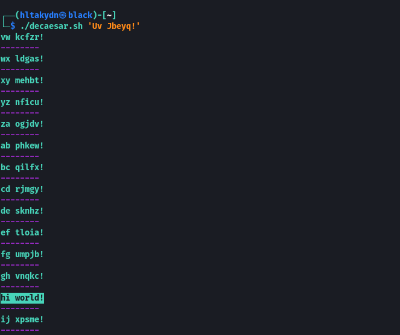

# Caesar





```bash
#!/bin/bash

leg=$@

function decaesar() {
    local value
    local cipher
    value=({a..z})
    cipher=()
    cipher+=("${value[@]:(-(26 - $2))}")
    cipher+=("${value[@]:0:$(($2 + 1))}")
    echo "$1" | tr '[:upper:]' '[:lower:]' | tr "${value[*]}" "${cipher[*]}"
}

for i in {1..26}; do
    printf "\e[32m$(decaesar "$@" $i) \033[0m \n\033[0;35m"; seq -s- ${#leg}|tr -d '[:digit:]'
done

```


```bash
chmod +x decaesar.sh
```

```bash
./caesar.sh 'Uv Jbeyq!' 
```



