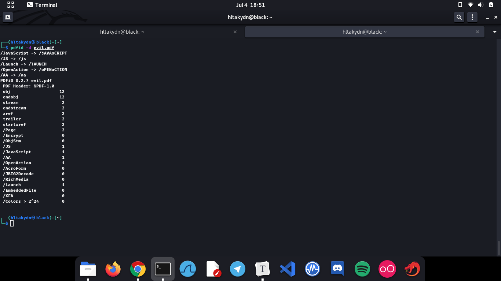
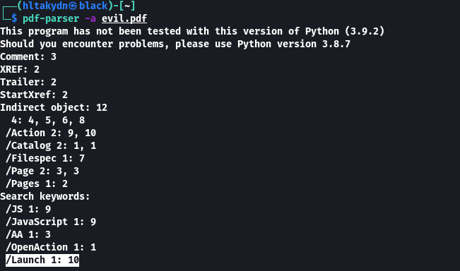

# PDF Forensics

## Pdfid

Analyzes pdf file

```bash
pdfid evil.pdf
```


```bash
pdfid -d evil.pdf
```



## Pdf Parser

To get the stats of the PDF Document.

```bash
pdf-parser -a evil.pdf
```



Passing stream data through Filters FlateDecode,ASCIIHexDecode, ASCII85Decode, LZWDecode and RunLengthDecode.

```bash
pdf-parser -f evil.pdf
```


To get the Hashes of the PDF file.

```bash
pdf-parser -H evil.pdf
```


Case sensitive search in streams

```bash
pdf-parser --casesensitive evil.pdf
```


To get the javascripts added with the document.

```bash
pdf-parser --search javascript --raw evil.pdf
```


That will parse the entire PDF and its objects. We can also parse each object of the pdf file.


On observation, objects 10 attracted some attention.


```bash
pdf-parser -o 10 evil.pdf
```

## **References**

* [https://blog.didierstevens.com/programs/pdf-tools/](https://blog.didierstevens.com/programs/pdf-tools/)
* [https://gitlab.com/kalilinux/packages/pdf-parser](https://gitlab.com/kalilinux/packages/pdf-parser)

