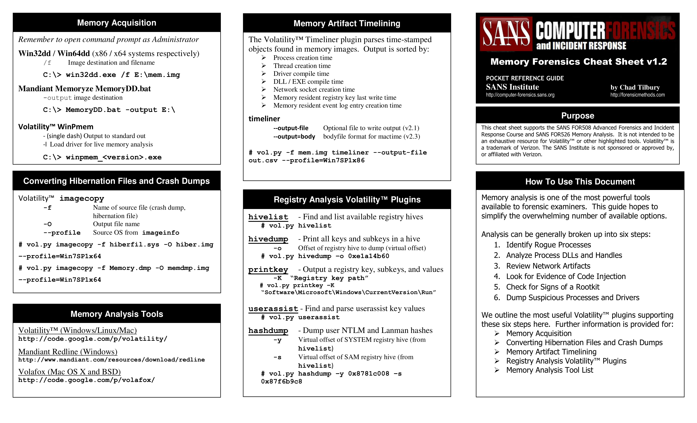
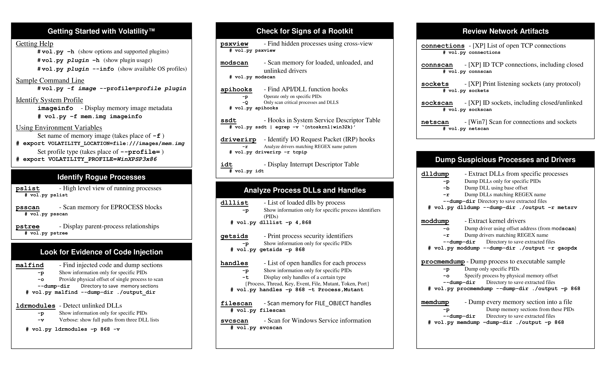

# Volatility

## OS Profiles

```bash
volatility imageinfo -f file.dmp
volatility -f file.dmp windows.info.Info
```

## Hashes/Passwords

```bash
volatility -f file.dmp windows.hashdump.Hashdump #Grab common windows hashes (SAM+SYSTEM)
volatility -f file.dmp windows.cachedump.Cachedump #Grab domain cache hashes inside the registry
volatility -f file.dmp windows.lsadump.Lsadump #Grab lsa secrets
```

## Memory Dump

```bash
volatility -f file.dmp --profile=Win7SP1x86 memdump -p 2168 -D conhost/
```

### Processes

```bash
volatility -f file.dmp windows.pstree.PsTree # Get processes tree (not hidden)
volatility -f file.dmp windows.pslist.PsList # Get process list (EPROCESS)
volatility -f file.dmp windows.psscan.PsScan # Get hidden process list(malware
```

### Dump proc

```bash
volatility -f file.dmp windows.dumpfiles.DumpFiles --pid <pid> #Dump the .exe and dlls of the process in the current directory
```

### Command Line

```bash
volatility -f file.dmp windows.cmdline.CmdLine
```

### Environment

```bash
volatility -f file.dmp windows.envars.Envars [--pid <pid>] #Display process environment variables
```

### Token privileges

```bash
#Get enabled privileges of some processes
volatility -f file.dmp windows.privileges.Privs [--pid <pid>]
#Get all processes with interesting privileges
volatility -f file.dmp windows.privileges.Privs | grep "SeImpersonatePrivilege\|SeAssignPrimaryPrivilege\|SeTcbPrivilege\|SeBackupPrivilege\|SeRestorePrivilege\|SeCreateTokenPrivilege\|SeLoadDriverPrivilege\|SeTakeOwnershipPrivilege\|SeDebugPrivilege"
```

### SIDs

```bash
volatility -f file.dmp windows.getsids.GetSIDs [--pid <pid>] #Get SIDs of processes
volatility -f file.dmp windows.getservicesids.GetServiceSIDs #Get the SID of services
```

### Handles

```bash
volatility -f file.dmp windows.handles.Handles [--pid <pid>]
```

### DLLs

```bash
volatility -f file.dmp windows.dlllist.DllList [--pid <pid>] #List dlls used by each
volatility -f file.dmp windows.dumpfiles.DumpFiles --pid <pid> #Dump the .exe and dlls of the process in the current directory process
```

### Strings per processe

```bash
strings file.dmp > /tmp/strings.txt
volatility -f /tmp/file.dmp windows.strings.Strings --string-file /tmp/strings.txt
```

```bash
volatility -f file.dmp windows.vadyarascan.VadYaraScan --yara-rules "https://" --pid 3692 3840 3976 3312 3084 2784
volatility -f file.dmp yarascan.YaraScan --yara-rules "https://"
```

## Services

```bash
volatility -f file.dmp windows.svcscan.SvcScan #List services
volatility -f file.dmp windows.getservicesids.GetServiceSIDs #Get the SID of services
```

## Network

```bash
volatility -f file.dmp windows.netscan.NetScan
#For network info of linux use volatility2
```

## Registry hive

### Print available hives

```bash
volatility -f file.dmp windows.registry.hivelist.HiveList #List roots
volatility -f file.dmp windows.registry.printkey.PrintKey #List roots and get initial subkeys
```

### Get a Value

```bash
.volatility -f file.dmp windows.registry.printkey.PrintKey --key "Software\Microsoft\Windows NT\CurrentVersion"
```

### Dump

```bash
#Dump a hive
volatility --profile=Win7SP1x86_23418 hivedump -o 0x9aad6148 -f file.dmp #Offset extracted by hivelist
#Dump all hives
volatility --profile=Win7SP1x86_23418 hivedump -f file.dmp
```

## Filesystem

### Scan/dump

```bash
volatility -f file.dmp windows.filescan.FileScan #Scan for files inside the dump
volatility -f file.dmp windows.dumpfiles.DumpFiles --physaddr <0xAAAAA> #Offset from previous command
```

### SSL Keys/Certs

```bash
volatility -f file.dmp windows.registry.certificates.Certificates
```

## Malware

```bash
volatility -f file.dmp windows.malfind.Malfind [--dump] #Find hidden and injected code, [dump each suspicious section]
#Malfind will search for suspicious structures related to malware
volatility -f file.dmp windows.driverirp.DriverIrp #Driver IRP hook detection
volatility-f file.dmp windows.ssdt.SSDT #Check system call address from unexpected addresses
volatility -f file.dmp linux.check_afinfo.Check_afinfo #Verifies the operation function pointers of network protocols
volatility -f file.dmp linux.check_creds.Check_creds #Checks if any processes are sharing credential structures
volatility -f file.dmp linux.check_idt.Check_idt #Checks if the IDT has been altered
volatility -f file.dmp linux.check_syscall.Check_syscall #Check system call table for hooks
volatility -f file.dmp linux.check_modules.Check_modules #Compares module list to sysfs info, if available
volatility -f file.dmp linux.tty_check.tty_check #Checks tty devices for hooks
```

### Scanning with yara

```bash
wget https://gist.githubusercontent.com/andreafortuna/29c6ea48adf3d45a979a78763cdc7ce9/raw/4ec711d37f1b428b63bed1f786b26a0654aa2f31/malware_yara_rules.py
mkdir rules
python malware_yara_rules.py
#Only Windows
volatility -f file.dmp windows.vadyarascan.VadYaraScan --yara-file /tmp/malware_rules.yar
#All
volatility -f file.dmp yarascan.YaraScan --yara-file /tmp/malware_rules.yar
```

## MISC

### External plugins

```bash
volatility --plugin-dirs "/tmp/plugins/" [...]
```

### Autoruns

```bash
 volatility --plugins=volatility-autoruns/ --profile=WinXPSP2x86 -f file.dmp autoruns
```





## **References**

* \*\*\*\*[**https://github.com/volatilityfoundation/volatility**](https://github.com/volatilityfoundation/volatility)\*\*\*\*
* \*\*\*\*[**https://www.sans.org/digital-forensics-incident-response/**](https://www.sans.org/digital-forensics-incident-response/)\*\*\*\*
* \*\*\*\*[**https://book.hacktricks.xyz/**](https://book.hacktricks.xyz/)\*\*\*\*

